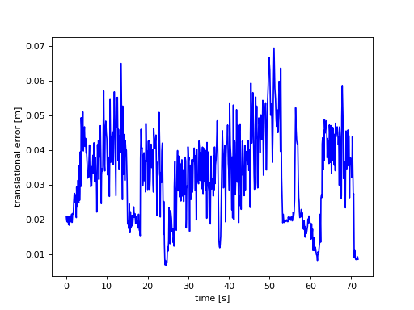

# First test

**Params used:**

**Validation output:** 

- translational_error.rmse: 0.031195 m
- translational_error.mean: 0.028596 m
- translational_error.median: 0.029305 m
- translational_error.std: 0.012467 m
- translational_error.min: 0.001742 m
- translational_error.max: 0.068226 m
- rotational_error.rmse: 1.967327 deg
- rotational_error.mean: 1.674367 deg
- rotational_error.median: 0.028705 deg
- rotational_error.std: 1.032894 deg
- rotational_error.min: 0.024858 deg
- rotational_error.max: 4.455914 deg

# Second test

**Params used:**

Changing bidirectional to 'True'.

**Validation output:** 

- translational_error.rmse: 0.029723 m
- translational_error.mean: 0.026980 m
- translational_error.median: 0.028112 m
- translational_error.std: 0.012472 m
- translational_error.min: 0.002829 m
- translational_error.max: 0.063260 m
- rotational_error.rmse: 2.160571 deg
- rotational_error.mean: 1.830685 deg
- rotational_error.median: 0.030491 deg
- rotational_error.std: 1.147459 deg
- rotational_error.min: 0.057126 deg
- rotational_error.max: 14.127665 deg

# Third test

**Params used:**
Changing hidden_size to 256.

**Validation output:** 

- translational_error.rmse: 0.034532 m
- translational_error.mean: 0.032399 m
- translational_error.median: 0.032699 m
- translational_error.std: 0.011948 m
- translational_error.min: 0.006933 m
- translational_error.max: 0.069515 m
- rotational_error.rmse: 1.958694 deg
- rotational_error.mean: 1.654288 deg
- rotational_error.median: 0.027902 deg
- rotational_error.std: 1.048720 deg
- rotational_error.min: 0.004649 deg
- rotational_error.max: 4.488099 deg

